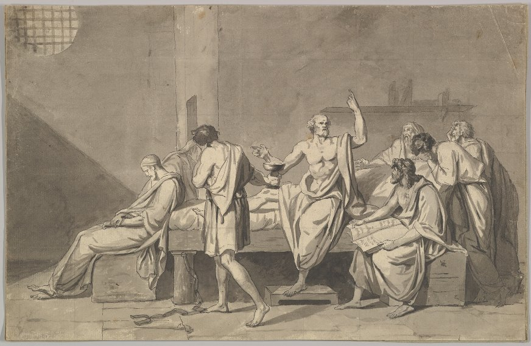

# Philosophy and Critical Thinking

:::: {.centerpic data-latex=""}

{width="50%" alt="illustration"}


::: {.centercap data-latex=""}

Jacques-Louis David, "The Death of Socrates"

:::

::::

::: {.epigraph data-latex=""}

The unexamined life is not worth living.\
\
---Socrates
:::

::::{.center data-latex=""}
::: {.argument data-latex=""}

Then raising the cup to his lips, quite readily and cheerfully he drank off the poison. Until this point most of us had been able to control our sorrow; but now when we saw him drinking, and saw too that he had finished the draught, we could no longer hold off, and in spite of myself my own tears were flowing fast, so that I covered my face and wept, not for him, but at the thought of my own calamity in having to part from such a friend.^[[@platoPhaedo]]

:::
::::

**_This is Plato's account_** of what an eyewitness saw when he witnessed the last living moments of their teacher Socrates. Socrates was executed in 399 BCE in his hometown of Athens, Greece in the customary way of being given a cup of poison hemlock extract to drink, for the crimes of "corrupting the youth" and "preaching false gods." What he really did was spend his days engaging his fellow citizens in dialogue about anything and everything, but especially focused on questions concerning how we all should live our lives, as well as challenging everyone he met to account for and defend their assumptions about how to live. But his relentless questioning earned him many enemies who preferred that the youth, and everybody else, rest content in the assumption that the best way to live is to seek fame and fortune and try to live the "good life" that these seem to make possible. Socrates was not convinced and advocated the life of the philosopher, turning away from worldly pursuits and instead reflecting on and critically examining our deepest assumptions and ultimately being willing to admit how little we really know.

**_Socrates_** was famous for his saying that "the unexamined life is  not worth living." What he meant by this is that all of us have a responsibility to examine our own beliefs and try to figure out whether or not they are really true. Not doing this is like sleepwalking through life. This might be pleasant but it runs the risk of us devoting our lives to things that don't truly matter, and even worse it leads us to neglect developing our unique capacity as human beings. Unlike other animals, we can mentally take a step back from what we see in front of us and ask, "Should I trust what I see or not?" Likewise with everything we do:  we can examine our own desires, intentions and plans and ask ourselves, "Should I act on these or not?" In both cases we are capable of distancing ourselves from the immediate demands of our situation and seeking orientation from another source -- we seek *reasons* to believe or doubt what we see and *reasons* to follow or resist our urges. This reflective capacity is the source of our strength since it has enabled us to understand and manipulate the world around us like no other creature on the planet. But, as we can now see more clearly than perhaps Socrates could, it also puts us in the uniquely awkward position of having to justify ourselves to our own worst critics, ourselves. 

## Timeline: Ancient Greek Philosophy and Science

<iframe src='https://cdn.knightlab.com/libs/timeline3/latest/embed/index.html?source=1sdJvv8xvp1t_hJdHoS8OyKl5wivi3uAC3c8__rimzO8&font=Default&lang=en&initial_zoom=2&height=650' width='100%' height='650' webkitallowfullscreen mozallowfullscreen allowfullscreen frameborder='0'></iframe>

## another timeline

<iframe src="http://www.6worlds.net/science-blog/wp-admin/admin-ajax.php?action=h5p_embed&id=1" width="908" height="625" frameborder="0" allowfullscreen="allowfullscreen"></iframe>

## Socrates on Trial


:::{.passage data-latex=""}

::::{.note data-latex=""}

Plato, *The Apology*, translated by Benjamin Jowett. 

Full text available at the [Gutenberg Project](https://www.gutenberg.org/files/1656/1656-h/1656-h.htm).

::::

I dare say, Athenians, that some one among you will reply, 'Yes, Socrates, but what is the origin of these accusations which are brought against you; there must have been something strange which you have been doing? All these rumours and this talk about you would never have arisen if you had been like other men: tell us, then, what is the cause of them, for we should be sorry to judge hastily of you.' Now I regard this as a fair challenge, and I will endeavour to explain to you the reason why I am called wise and have such an evil fame. Please to attend then. And although some of you may think that I am joking, I declare that I will tell you the entire truth. Men of Athens, this reputation of mine has come of a certain sort of wisdom which I possess. If you ask me what kind of wisdom, I reply, wisdom such as may perhaps be attained by man, for to that extent I am inclined to believe that I am wise; whereas the persons of whom I was speaking have a superhuman wisdom which I may fail to describe, because I have it not myself; and he who says that I have, speaks falsely, and is taking away my character. And here, O men of Athens, I must beg you not to interrupt me, even if I seem to say something extravagant. For the word which I will speak is not mine. I will refer you to a witness who is worthy of credit; that witness shall be the God of Delphi—he will tell you about my wisdom, if I have any, and of what sort it is. You must have known Chaerephon; he was early a friend of mine, and also a friend of yours, for he shared in the recent exile of the people, and returned with you. Well, Chaerephon, as you know, was very impetuous in all his doings, and he went to Delphi and boldly asked the oracle to tell him whether—as I was saying, I must beg you not to interrupt—he asked the oracle to tell him whether anyone was wiser than I was, and the Pythian prophetess answered, that there was no man wiser. Chaerephon is dead himself; but his brother, who is in court, will confirm the truth of what I am saying.


:::

## Summary {-}

:::{.slideshow  data-latex="Here is a slideshow summary which can be \href{https://gwmatthews.github.io/ethics-slideshows/01-slides.html}{viewed online}, \href{https://gwmatthews.github.io/ethics-slideshows/pdf/01-slides.pdf}{downloaded} or \href{https://gwmatthews.github.io/ethics-slideshows/pdf/01-handout.pdf}{printed}."}
<iframe src="https://gwmatthews.github.io/ethics-slideshows/01-slides.html">
</iframe>
:::

```{asis, echo=identical(knitr:::pandoc_to(), 'html')}

- [Download slides](https://gwmatthews.github.io/ethics-slideshows/pdf/01-slides.pdf) or [print them](https://gwmatthews.github.io/ethics-slideshows/pdf/01-handout.pdf).

```


## Further exploration {-}

- Michael Sandel is a philosophy professor at Harvard who teaches a very popular course called "Justice" that explores material that overlaps with this text. His extensive website [Justice with Michael Sandel](http://justiceharvard.org/){target="_blank"} also has videos of his lectures from that course the first of which focuses on the famous runaway trolley example.


```{asis, echo=identical(knitr:::pandoc_to(), 'html')}
  <br>
  <br>
  <hr>


**Editorial comments**

If you have a GitHub account and want to make any editorial suggestions, please do so here.

<script src="https://utteranc.es/client.js"
        repo="gwmatthews/ethics"
        issue-term="title"
        theme="github-light"
        crossorigin="anonymous"
        async>
</script>

```


